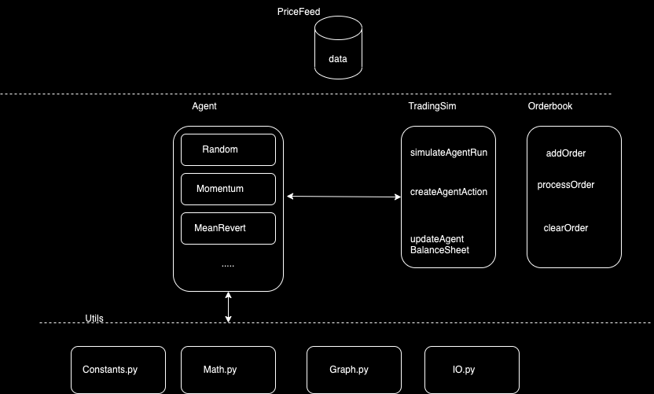
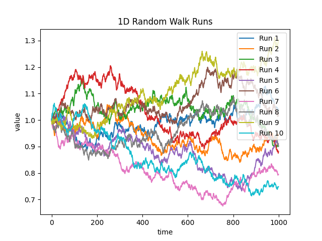

### awesome-quant-agents

A Pythonic framework for Implementation and Simulation of Autonomous Finance.

#### Setup

1. Install Poetry package management package
`curl -sSL https://install.python-poetry.org | python3 -`

2. Install dependencies from `poetry.lock`
`poetry install`

3. Configure `data/pricefeed.py` for auto-generating price feed.

4. Run `python3 main.py` to start the simulation.

#### Example

As an example, 4 processes are run as part of the main script involving,
- Randomwalk data generation
- Random Agent Sim
- Momentum Agent Sim
- Mean Revert Agent Sim

#### Architecture

#### Plots

#### Results

All agent interactions and balances are updated as JSON file, across the simulation time period.
As found in `/results` dir.
